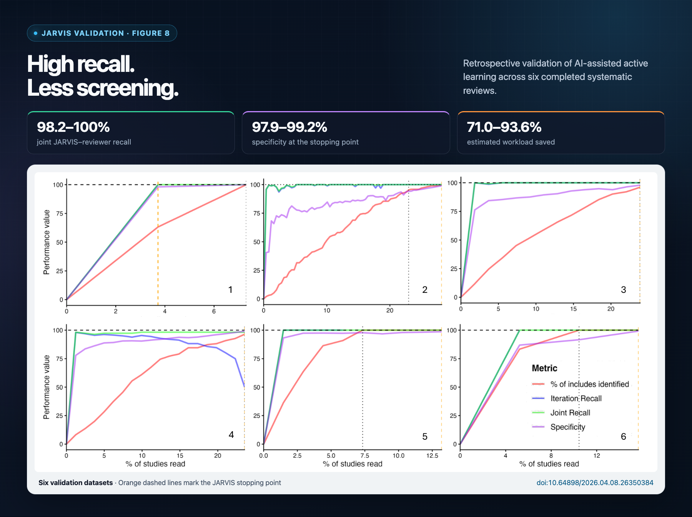
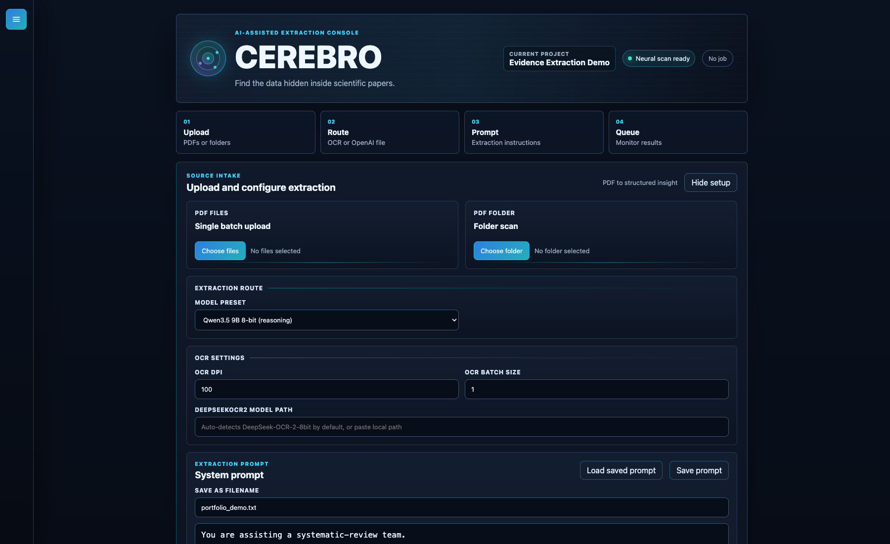
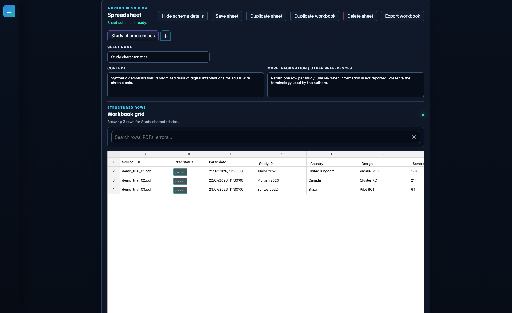
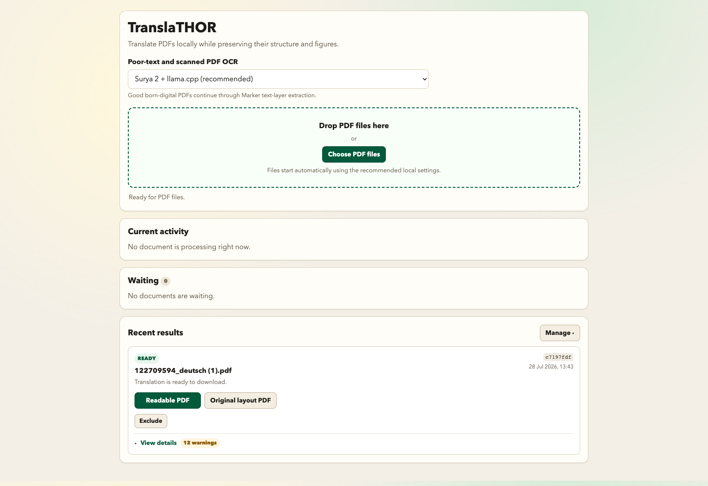
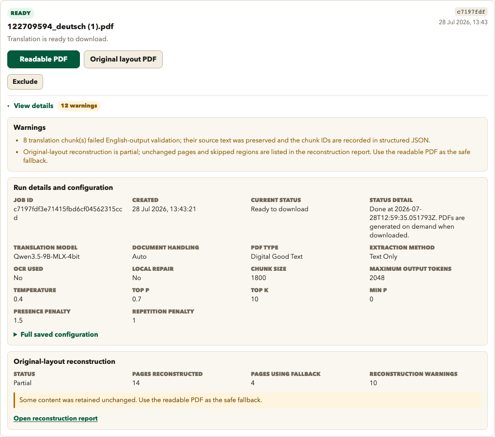
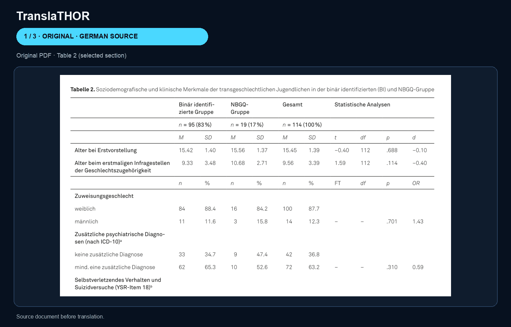

# Gabriel Barreto, PhD

### Evidence synthesis · Research software · AI-assisted review methods

[Google Scholar](https://scholar.google.com/citations?user=do8mcsEAAAAJ&hl=en) ·
[ResearchGate](https://www.researchgate.net/profile/Gabriel-Henrique-Barreto)

I am an evidence-synthesis researcher and research-software developer based in
the United Kingdom. I currently work as a **Senior Research Associate in
Evidence Synthesis at the University of Bristol**, where I conduct
policy-relevant systematic reviews and develop digital tools that make review
workflows more efficient, transparent, and reproducible.

My work sits at the intersection of **systematic review methodology, software
development, and applied AI**. I combine first-hand experience in evidence
synthesis with Python, R, statistical evaluation, and user-centred development
to turn recurring research problems into practical tools.

I hold a **PhD in Musculoskeletal System Sciences** and an **MBA in Data Science
and Analytics**, and I have authored more than 20 peer-reviewed publications.

## Selected research software

### [JARVIS](https://github.com/gabsbarreto/JARVIS-R)

**AI-assisted systematic-review screening and active learning**

JARVIS combines LLM-based assessment of PICOS criteria, title and abstract
information, and active learning to prioritise records during study screening.
I conceptualised and developed the method, evaluated it retrospectively across
six completed systematic reviews, and examined both workload reduction and the
safety implications of incorrectly excluded studies.

The public repository contains the R-based evaluation and simulation framework.
It includes feature engineering, iterative H2O deep-learning screening loops,
hyperparameter experiments, and measures of recall, screening burden, and work
saved.

`R` · `H2O` · `active learning` · `LLM evaluation` · `systematic reviews`

[Validation preprint · DOI: 10.64898/2026.04.08.26350384](https://doi.org/10.64898/2026.04.08.26350384)

#### Validation performance

*Figure 8 tracks records identified, within-iteration recall, joint
JARVIS–reviewer recall, and specificity as human screening progresses across
six retrospective validation datasets.*

### JARVIS-UI

**End-to-end AI-assisted screening platform** · Private repository

JARVIS-UI is the Django application that turns the JARVIS screening method into
a complete reviewer workflow. It supports reference import and deduplication,
LLM assessment against review-specific eligibility criteria, independent human
screening, conflict management, and active-learning prioritisation.

The platform brings automated assessment and reviewer decisions together in a
single interface. It is designed to keep humans in control of eligibility
decisions while using model outputs and continuously updated predictions to
focus screening effort where it is most useful.

`Python` · `Django` · `LLM integration` · `active learning` · `reference screening`

### [CEREBRO](https://github.com/gabsbarreto/CEREBRO)

**AI-assisted structured data extraction from scientific documents**

CEREBRO is a FastAPI application for extracting structured information from
scientific PDFs, spreadsheets, and text records. It supports local OCR and
language-model workflows as well as direct PDF analysis through OpenAI.
Reviewers can define extraction questions and rules, manage processing queues,
retry failed jobs, inspect outputs, and export structured results to Excel.

I developed CEREBRO and applied it within a major programme of linked
systematic reviews, comparing its outputs with human reference data.

`Python` · `FastAPI` · `OCR` · `OpenAI API` · `structured extraction`

#### Interface preview

*PDF extraction console showing CEREBRO's upload, routing, OCR, and prompt
workflow.*

*Structured workbook showing a configurable extraction schema and synthetic
trial-level results. No production research data is shown.*

### [TranslaTHOR](https://github.com/gabsbarreto/TranslaTHOR)

**Local-first translation for multilingual full-text screening**

TranslaTHOR is a local application for translating digital and scanned
scientific PDFs into English. It detects document type, combines
layout-sensitive extraction and OCR, and uses local Qwen models to produce
traceable translated outputs while preserving tables, figures, and document
structure where possible.

I developed the tool to support multilingual full-text screening without
requiring research documents to be sent to an external translation service.

`Python` · `FastAPI` · `OCR/VLM pipelines` · `Qwen` · `local AI`

#### Interface preview

*The local dashboard supports PDF upload and provides both readable and
original-layout downloads when a translation is complete.*

*Each run retains its configuration, processing details, validation warnings,
and original-layout reconstruction status for inspection.*

#### Translation comparison

*Table 2 from a completed translation, shown as the original German source,
the English translation reconstructed in the source layout, and the reflowed
readable English output.*

## Expertise

| Area | Methods and technologies |
| --- | --- |
| Evidence synthesis | Systematic and scoping reviews, screening, structured extraction, RoB 2, ROBINS-I, ROBINS-E, meta-analysis, GRADE, PRISMA |
| Research software | Python, R, SQL, Django, FastAPI, PostgreSQL, Celery/Redis, Docker, Git/GitHub |
| AI and evaluation | LLM integration, OCR/VLM pipelines, local MLX/Qwen models, active learning, human-reference validation, error analysis |
| Quantitative methods | Statistical modelling, machine learning, meta-regression, reproducible analysis, survey-weighted methods |
| Product development | Requirements gathering, workflow mapping, prompt and schema design, prototyping, testing, documentation, iterative refinement |

## Experience

**Senior Research Associate in Evidence Synthesis** 
University of Bristol · June 2025–present

- Conduct end-to-end systematic reviews addressing health and social-care
  policy questions.
- Develop and evaluate software for AI-assisted screening, multilingual
  full-text processing, and structured data extraction.
- Maintain and deploy research applications within university infrastructure.

**Doctoral Researcher and Research Collaborator** 
University of São Paulo · October 2018–September 2024

- Led and contributed to systematic reviews and meta-analyses with
  international research teams.
- Coordinated reviewers and performed searching, extraction, critical
  appraisal, GRADE assessment, statistical synthesis, and meta-regression.
- Designed human studies and built automated data-processing and statistical
  workflows in R.

## Education

- **MBA in Data Science and Analytics**, University of São Paulo, 2025 
  Capstone: *The association between caffeine consumption and biomarkers of
  cardiovascular and metabolic health.*
- **Direct PhD in Musculoskeletal System Sciences**, University of São Paulo,
  2024 
  Thesis: *CYP1A2 genotypes on the physiological responses to caffeine in
  humans.*
- **International Research Internship**, Edge Hill University, 2023 
  Project: *CYP1A2, caffeine and sports performance: just a matter of timing?*
- **Bachelor's degree in Nutrition and Dietetics**, São Camilo University
  Centre, 2013

## Selected research outputs

1. Barreto, G., et al. (2026). *JARVIS, should this study be selected for
   full-text screening? Performance of a Joint AI-ReViewer Interactive
   Screening tool for systematic reviews.* medRxiv preprint.
   [doi:10.64898/2026.04.08.26350384](https://doi.org/10.64898/2026.04.08.26350384).
2. Curran-Bowen, T., da Silva, A. G., Barreto, G., Buckley, J., & Saunders, B.
   (2024). Sodium bicarbonate and beta-alanine supplementation: Is combining
   both better than either alone? *Biology of Sport, 41*(3), 79–87.
3. Gavel, E. H., Barreto, G., et al. (2024). How cool is that? The effects of
   menthol mouth rinsing on exercise capacity and performance: a systematic
   review and meta-analysis. *Sports Medicine–Open, 10*, 18.
4. Barreto, G., Esteves, G. P., Marticorena, F., Oliveira, T. N., Grgic, J., &
   Saunders, B. (2023). Caffeine, CYP1A2 genotype and exercise performance: a
   systematic review and meta-analysis. *Medicine & Science in Sports &
   Exercise*.
5. Barreto, G., Loureiro, L., Reis, C., & Saunders, B. (2023). Effects of
   caffeine chewing gum supplementation on exercise performance: a systematic
   review and meta-analysis. *European Journal of Sport Science, 23*(5),
   714–725.
6. Esteves, G. P., Barreto, G., Longhini, F., Dolan, E., & Benatti, F. B.
   (2023). The influence of n-3 PUFA supplementation on muscle strength, mass
   and function: a systematic review and meta-analysis. *Advances in Nutrition,
   14*(1), 115–127.

[View my complete publication record on Google Scholar](https://scholar.google.com/citations?user=do8mcsEAAAAJ&hl=en).

## Recognition

- Three competitive São Paulo Research Foundation (FAPESP) awards supporting
  postgraduate research and an international research internship.
- ACSM International Student Award, American College of Sports Medicine Annual
  Meeting, 2023.
- Best Poster Award, University of São Paulo Research Symposium, 2018.

## Languages

Brazilian Portuguese (native) · English (fluent, C1) · Spanish (advanced)
